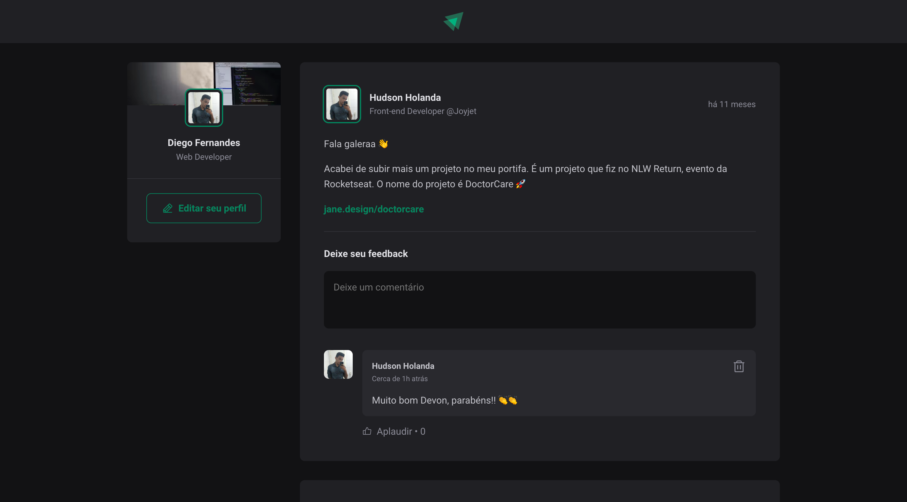

<p align="center">
  
</p>

<br />

<p align="center">
  
  
</p>

[](https://github.com/lzhudson)
[](#)
[](https://github.com/lzhudson/ignite-feed/stargazers)
[](https://github.com/lzhudson/ignite-feed/network/members)
[](https://github.com/lzhudson/ignite-feed/graphs/contributors)

---

# :pushpin: Table of Contents

* [Features](#rocket-features)
* [Installation](#construction_worker-installation)
* [Getting Started](#runner-getting-started)
* [Found a bug? Missing a specific feature?](#bug-issues)
* [Contributing](#tada-contributing)
* [License](#closed_book-license)

# :rocket: Features

* Adding comments
* Like comments

# :construction_worker: Installation

**You need to install [Node.js](https://nodejs.org/en/download/) and [Yarn](https://yarnpkg.com/) first, then in order to clone the project via HTTPS, run this command:**

```
git clone https://github.com/lzhudson/ignite-feed.git
```
